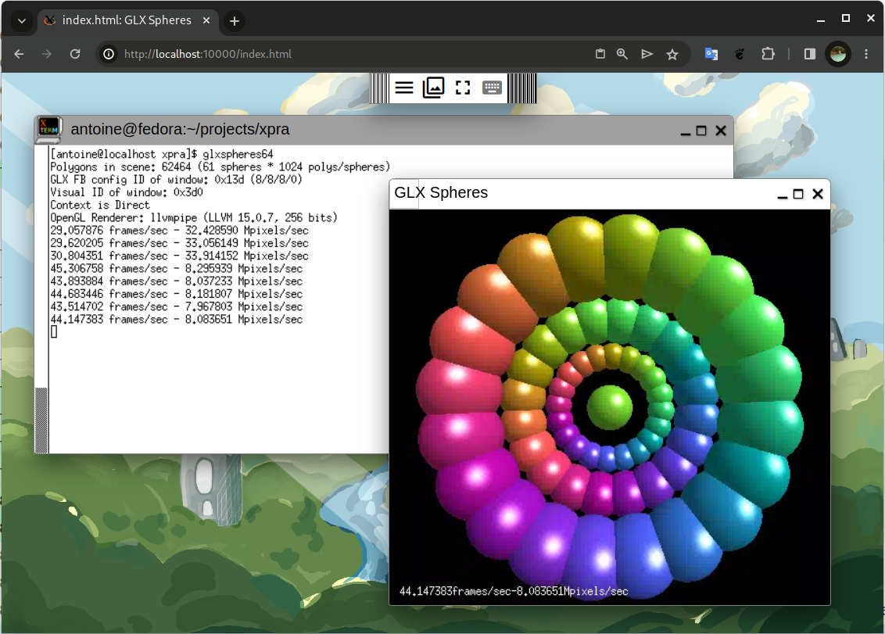
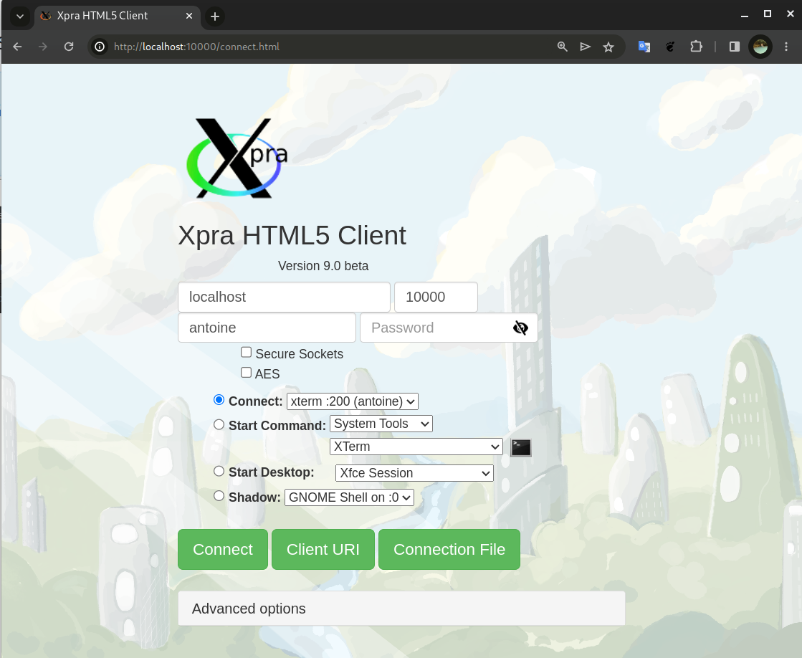
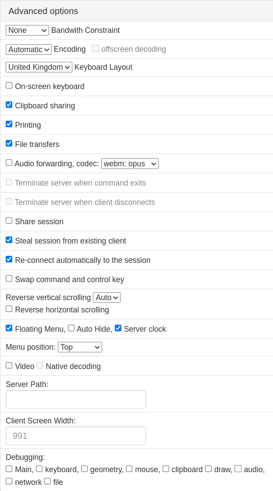

# HTML5 client for Xpra

Simply point your browser to the contents of the `html5` folder,
and you will get an HTML5 client which you can use to connect to
any [xpra](https://github.com/Xpra-org/xpra) server.

This client is usually packaged as `xpra-html5`
and the xpra server will normally pick it up automatically
so that you can access it using the builtin web server.

# Sample Screenshot

Here is a [xpra seamless](https://github.com/Xpra-org/xpra/blob/master/docs/Usage/Seamless.md) session
with an `xterm` and `glxspheres` shown running in Google Chrome:



# Installation

The [xpra repositories and packages](https://github.com/Xpra-org/xpra/wiki/Download) already include the html5 client.  
Just install `xpra-html5` from there.

---

To install from source:
```
git clone https://github.com/Xpra-org/xpra-html5
cd xpra-html5
./setup.py install
```

On Linux, this will install the html5 client in `/usr/share/xpra/www` which is where the xpra server expects to find it.

To install with Nginx or Apache, you may need to change the installation path to something like `/var/www/html/`.

To generate your own RPMs or DEBs, just run: `./setup.py rpm` or `./setup.py deb`.


# Usage

Simply start an xpra session on a specific `TCP` port (ie: `10000`):

```
xpra start --start=xterm --bind-tcp=0.0.0.0:10000
```

Then you can access this session with your browser by pointing it to that port. ie locally:

```
xdg-open http://localhost:10000/
```

For more information on xpra server options, please refer to the [xpra project](https://github.com/Xpra-org/xpra).


# Configuration

Most common HTML5 client options can be specified from the connect dialog
form, which is found at `/connect.html`.  

This screenshot shows the dialog when loaded from a [proxy server](https://github.com/Xpra-org/xpra/blob/master/docs/Usage/Proxy-Server.md)
which is able to populate more connection options.

Failures to connect to a server from the default page should also redirect to this connection dialog page automatically.

All of the options can also be specified as URL parameters. ie:

```
http://localhost:10000/?username=foo&keyboard_layout=fr
```

For a more complete list of options, see [configuration options](./docs/Configuration.md)  
The _advanced options_ of the connection dialog exposes some of them:


# Compatibility

This client is compatible with any [currently supported version](https://github.com/Xpra-org/xpra/wiki/Versions) of xpra.
